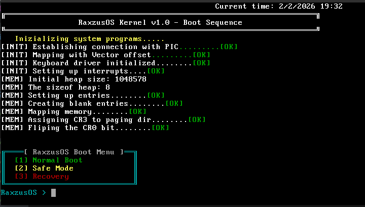

# Raxzer OS — Custom x86 Kernel

A monolithic x86 kernel built from scratch in C and Assembly. This is a personal learning project aimed at understanding how operating systems work at the lowest level — from bootloading to virtual memory.

## Boot Screen



## Features

- **Bootloader** — GRUB multiboot, boots via ISO in QEMU
- **VGA Text Mode** — Direct video memory output at `0xB8000` with color support
- **IDT & PIC** — Full interrupt descriptor table with remapped PIC (IRQ 0–15 mapped to IDT 32–47)
- **Keyboard Driver** — IRQ 1 handler for keyboard input
- **PIT Timer** — Programmable interval timer at 100Hz (10ms intervals) driving the scheduler
- **Dynamic Heap** — Custom `kmalloc`/`kfree` with block headers, 8-byte alignment, and coalescing free blocks
- **Preemptive Multitasking** — Round-robin scheduler with timer-driven context switching
- **Context Switching** — ESP-based process switching via assembly, saving/restoring full CPU state
- **Process Control Block (PCB)** — Tracks saved ESP, PID, and process state
- **Fork** — Spawns child processes with independent stacks and unique PIDs (WIP)
- **Idle Process** — Always-running fallback process when all others sleep
- **Virtual Memory / Paging** — x86 two-level page tables (Page Directory + Page Tables), MMU-based address translation, kernel mapped at `0x00100000` (low-half kernel)
- **System Calls** — `int 0x80` based dispatch using EAX as syscall code
- **Boot Menu** — Interactive menu with Normal Boot, Safe Mode, and Recovery options
- **Custom Filesystem** — A filesystem designed from scratch with meant to crash loud but keep data accessible (WIP) 

## Memory Layout

```
[ GRUB Bootloader ] [ Kernel ] [ Paging Tables ] [ Heap (1MB) ]
  0x00100000          ~1MB+       After kernel       After paging
```

## Building & Running

> Requires: `i686-elf-gcc`, `nasm`, `grub-mkrescue`, `qemu-system-i386`

```bash
# Build
./run.sh

# Or manually:
i686-elf-gcc -c kernel.c -o kernel.o -std=gnu99 -ffreestanding -O2 -Wall -Wextra
i686-elf-gcc -T linker.ld -o myos.bin -ffreestanding -O2 -nostdlib boot.o kernel.o lib/io.o lib/vga.o -lgcc
grub-mkrescue -o myos.iso isodir

# Run in QEMU
qemu-system-i386 -cdrom myos.iso
```

## Tech Stack

- **Language:** C, x86 Assembly
- **Toolchain:** i686-elf-gcc, NASM, GRUB, QEMU
- **Architecture:** x86 (32-bit protected mode)

## Status

Active development. Getting page allocation functionality in the kernel to work, so processes can request pages and run user space programs.


